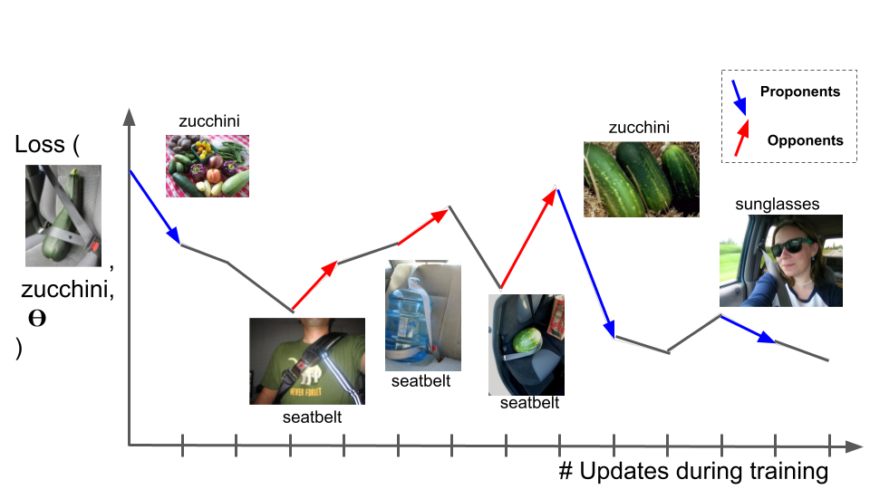

# TracIn
Reproducing TracIn (Tracing Gradient Descent) using PyTorch and MNIST dataset.

Original paper [Implementation of Estimating Training Data Influence by Tracing Gradient Descent](https://arxiv.org/pdf/2002.08484.pdf)

Original Repo https://github.com/frederick0329/TracIn

## Idea: Trace Stochastic Gradient Descent (Using the loss function as F)

## Equation 

